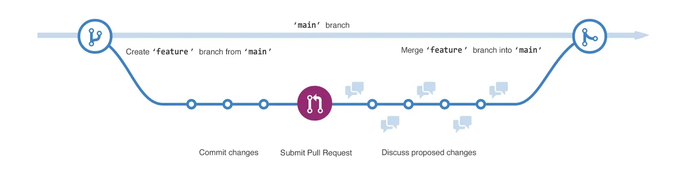

# Learning Git

## Purpose
Build proficiency and confidence in using Git.


## Requirements
Before you begin, ensure Git is installed and your environment is ready.

### Windows
CLI:
```
winget install --id Git.Git -e --source winget
```

GUI:

- Download and execute the [Git](https://github.com/git-for-windows/git/releases/download/v2.51.0.windows.1/Git-2.51.0-64-bit.exe) installer.

### For Linux
RHEL:
```
dnf install git
```

DEB:
```
apt install git
```

## What is Git
Git is a free and open source distributed version control system designed to handle everything from small to very large projects with speed and efficiency.

A version control system (VCS) tracks changes to files over time. It allows you to:

- Revert to earlier versions of files or entire projects
- Collaborate with others, even on the same files, without overwriting each other’s work

Git is also considered a software configuration management (SCM) tool. While “VCS” and “SCM” are often used interchangeably, SCM encompasses additional practices beyond version control. A VCS can be used for projects other than software, including books and online tutorials.

<div align="center">
<iframe width="560" height="315" src="https://www.youtube-nocookie.com/embed/hwP7WQkmECE?si=o2ppTGeKTs58PUqh" title="YouTube video player" frameborder="0" allow="accelerometer; autoplay; clipboard-write; encrypted-media; gyroscope; picture-in-picture; web-share" referrerpolicy="strict-origin-when-cross-origin" allowfullscreen></iframe>
</div>

## Basic Git Terminology
- __Working tree__: The set of nested directories and files that contain the project that's being worked on.
- __Repository (repo)__: The directory, located at the top level of a working tree, where Git keeps all the history and metadata for a project. Repositories are almost always referred to as repos. A bare repository is one that isn't part of a working tree; it's used for sharing or backup. A bare repo is usually a directory with a name that ends in .git (for example, project.git).
- __Hash__: A number produced by a hash function that represents the contents of a file or another object as a fixed number of digits. Git uses hashes that are 160 bits long. One advantage to using hashes is that Git can tell whether a file has changed by hashing its contents and comparing the result to the previous hash. If the file time-and-date stamp is changed, but the file hash isn’t changed, Git knows the file contents aren’t changed.
- __Object__: A Git repo contains four types of objects, each uniquely identified by an SHA-1 hash. A blob object contains an ordinary file. A tree object represents a directory; it contains names, hashes, and permissions. A commit object represents a specific version of the working tree. A tag is a name attached to a commit.
- __Commit__: When used as a verb, commit means to make a commit object. This action takes its name from commits to a database. It means you are committing the changes you have made so that others can eventually see them, too.
- __Branch__: A branch is a named series of linked commits. The most recent commit on a branch is called the head. The default branch, which is created when you initialize a repository, is called main, often named master in Git. The head of the current branch is named HEAD. Branches are an incredibly useful feature of Git because they allow developers to work independently (or together) in branches and later merge their changes into the default branch.
- __Remote__: A remote is a named reference to another Git repository. When you create a repo, Git creates a remote named origin that is the default remote for push and pull operations.
- __Commands, subcommands, and options__: Git operations are performed by using commands like git push and git pull. git is the command, and push or pull is the subcommand. The subcommand specifies the operation you want Git to perform. Commands frequently are accompanied by options, which use hyphens (-) or double hyphens (--). For example, `git reset --hard`.

## Configure Git
Before Git can track and attribute your changes, you need to set both a username and an email address in your configuration.  These can be set globally for all repositories or locally so that specific credentials are used for individual projects.
```
git config --global user.name "John Doe"
git config --global user.email johndoe@example.com
```

Verify settings:
```
git config --list
```
## Working with Git

### Initialize a Repository
Git tracks changes to files within a specific folder. To start using Git, we’ll create a folder for our project (called the *working tree*) and tell Git to begin tracking it by initializing a repository inside that folder.

- Make a new folder to contain your project files.
- Navigate to your project folder using your terminal or command prompt.
- Run the following command to create a new Git repository and set the default branch name to `main`:

```
git init -b main
```

### Staging & Committing Changes
The staging area (also called the index) is like a holding zone between your working directory (where you make changes) and the repository’s history (where commits live). When you edit files, Git doesn’t automatically commit them. Instead, you stage the changes you want to include in your next commit. This gives you fine-grained control over what gets committed and when.

Now that our repository is set up, let’s create a file, stage, & commit it so we can see the process in action.

- Create a new file in your project folder (for example, `hello.txt`) and add some content to it
- Stage and commit your changes in one step using:

```
git commit -am "<commit message>"
```

In this case we are staging all files that have changes made using the `-a` switch.  The `-m` specifies that you want to pass a commit message.

### Branches
When working on a project, a best practice to follow is to track each new feature or fix in its own branch.  Branches allow multiple versions of the code to exist in parallel, so you can develop without interfering with the main codebase or other people’s work.  The `main` is typically the production ready code while other branches are for development.


See what branches already exist
```
git branch -a
```

Create & switch to new branch
```
git checkout -b <new-branch-name>
```
The `-b` allows the creation of a new branch

Confirm your current branch
```
git status
```

## Repository Hosting
GitHub, GitLab, and Bitbucket are cloud-based platforms for hosting Git repositories. They simplify collaboration by providing:

- Centralized, shared code storage  
- Web-based interfaces for browsing and managing code  
- Command‑line integration  
- Built‑in workflows for issues, pull requests, and CI/CD

### Adding Your Project to GitHub
First we need to create a Repository on Github.

- Go to [github.com](https://github.com) and log in to your account.
- Click the plus icon in the top right corner then select `New repository`  
- Enter a repository name, description, and choose visibility (public or private)  
- Make sure not to initialize the repository with a README, `.gitignore`, or license since you already have a local repository  
- Click `Create repository`

Now we can link the local repository to GitHub
```
git remote add origin https://github.com/<your-username>/<repo-name>.git
```

Verify
```
git remote -v
```

Github will only reflect changes after you push commits
```
git push -u origin <branch>
```

The -u (or --set-upstream) flag tells Git to remember the remote/branch pairing, so future pushes can be done with just:
```
git push
```

### Creating a Pull Request
After finishing changes on a branch, you create a pull request(PR) to propose merging those changes into the destination branch. This allows team members to review the code, discuss improvements, and approve it before it becomes part of the main codebase.

- Go to [GitHub](https://github.com) and navigate to the repository containing your changes 
- Select the branch that contains the updates you want to merge into `main`
- If your branch is ahead of `main`, you’ll see a banner such as:  
   `This branch is X commits ahead of main` along with a `Contribute` dropdown
- Click `Contribute` -> `Open pull request`
- Enter a clear, descriptive title.  
- Provide a brief but informative description of the changes
- Confirm that the destination branch (e.g., `main`) and the compare branch (your feature branch) are correct.
- Click `Create pull request` to send it for review.

### Merging a Pull Request
If you were a reviewer or approver for a pull request these are the general steps you would want to take.

- Go to your repository on [GitHub](https://github.com) and click the pull request you want to merge
- Check the `Files changed` tab to verify the updates are correct and meet project standards
- Ensure all required checks (e.g., automated tests, code reviews) have passed if any.
- Click the `Merge pull request` button and select your preferred method:  
   `Create a merge commit`: Keeps full history with a merge commit  
   `Squash and merge`: Combines all commits into one before merging  
   `Rebase and merge`: Reapplies commits on top of the base branch without a merge commit
- Click `Confirm merge` to complete the process. 
- After merging, you can delete the feature branch to keep the repository clean. GitHub will show a `Delete branch` button if this option is available.

## References
- [DevMountain](https://github.com/DevMountain/learn-git)
- [Git First-Time Setup](https://git-scm.com/book/ms/v2/Getting-Started-First-Time-Git-Setup)
- [Intro to Git Microsoft](https://learn.microsoft.com/en-us/training/modules/intro-to-git/)